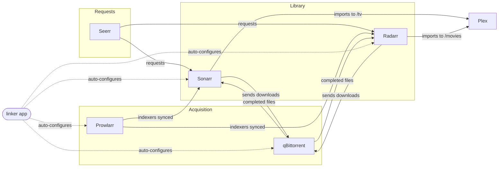

<div align="center">

# 🎬 Home Media Manager

**A self-hosted Plex ecosystem that wires itself together.**
One `docker compose up`, and Plex, Sonarr, Radarr, Prowlarr, qBittorrent and Seerr are
already talking to each other over their APIs — no clicking through five different
settings pages copy-pasting API keys.

[](https://docs.docker.com/compose/)
[](./linker)
[](./monitoring)
[]()

</div>

---

## Why this exists

Setting up a "*arr stack" the normal way means: install Sonarr, install Radarr, install
Prowlarr, install a torrent client, then manually go into each one's settings and
copy-paste API keys between them, set up download clients, set root folders, hope you
didn't typo a hostname. Every single time you rebuild the box.

This repo turns that into a stack you bring up once, plus a small companion app (the
**linker**) that does the tedious wiring for you and keeps re-asserting it so config
never silently drifts.

## What's in the box

| Layer | Services |
|---|---|
| 🎥 **Media server** | Plex |
| 📺 **Library management** | Sonarr (TV), Radarr (Movies) |
| 🔍 **Indexers** | Prowlarr |
| ⬇️ **Downloads** | qBittorrent |
| 📱 **Requests** | Seerr (the Jellyseerr/Overseerr successor) |
| 🔧 **Automation** | linker (this project's own app) + Watchtower |
| 📊 **Monitoring** | Prometheus + Grafana + cAdvisor |



## ✨ What gets wired up automatically

No clicking required for any of this — the linker does it on startup and every time you
hit "Re-link now":

- ✅ qBittorrent registered as the download client in **Sonarr** and **Radarr**
- ✅ Root folders (`/tv`, `/movies`) set in **Sonarr**/**Radarr**
- ✅ **Sonarr** + **Radarr** registered as Applications in **Prowlarr** (`fullSync` — add
  one indexer in Prowlarr, it appears in both automatically)
- ✅ qBittorrent's admin password enforced from `.env` on every startup
- ✅ qBittorrent's download path kept pointed at the shared `/downloads` volume, self-healing
- 🔄 Optional: **Watchtower** auto-updates every container, controlled by a toggle in the UI

### 🖥️ The linker's own dashboard

Open **http://localhost:5050** (or `http://<server-ip>:5050` if this isn't running on
your own machine) and you get:

- Live status + auto-linked state for every service
- **Host storage** — scans attached drives and lets you point all the media/download
  paths at one with a single click (creates the folders, rewrites `.env`, recreates the
  affected containers — fully automatic)
- **Plex claim** — paste a claim token, it's applied automatically
- **Connection info** — copy-paste-ready hostnames/ports/API keys for the one manual step
  Seerr still needs
- **Container updates** — on/off toggle + a manual "check now" button

## 🚀 Quick start

```bash
git clone https://github.com/bmark93/Home-Media.git
cd Home-Media
cp .env.example .env
```

Open `.env` and set at minimum:

| Variable | What it's for |
|---|---|
| `PUID` / `PGID` | Your user IDs (`id -u` / `id -g`) so files aren't owned by root |
| `QBIT_USER` / `QBIT_PASS` | qBittorrent login — enforced on every startup |
| `BIND_ADDRESS` | `0.0.0.0` for LAN access, `127.0.0.1` for this machine only |
| `PLEX_CLAIM` | Get one at https://www.plex.tv/claim/ **while logged in** — valid 5 min |

> **Tip:** grab the Plex claim token right before the next step since it expires fast.
> Missed it? No problem — set it later and run `docker compose up -d plex`.

```bash
docker compose up -d --build
```

First boot takes a couple of minutes (Sonarr/Radarr/Prowlarr initialize their
databases). The linker waits for everything to be healthy, then links it all together
automatically.

👉 Now open **http://localhost:5050** (`http://<server-ip>:5050` on a remote/headless
box) and watch it happen. The linker's own "Open" links in that dashboard always point
at whichever host/IP you're already viewing it from, so they work either way without
any configuration.

## 🧩 The few things that stay manual

These are tied to your accounts/personal choices — nothing can safely script them:

| Step | Why |
|---|---|
| Add indexers in **Prowlarr** | It's your personal tracker list |
| Sign into **Plex** + add libraries | Tied to your Plex account |
| Sign into **Seerr** + connect Sonarr/Radarr | Same reason — plus Seerr's settings API only accepts a logged-in session, not even an API key |

The linker's **Connection info** panel gives you copy-paste-ready values for the Seerr
step, so it's a two-minute job.

## 🌐 Service URLs

Replace `localhost` with your server's LAN IP or hostname if you're not running this on
the machine you're browsing from:

| Service | Port |
|---|---|
| 🔧 Linker (this app) | http://localhost:5050 |
| 🎬 Plex | http://localhost:32400/web |
| 📱 Seerr | http://localhost:5055 |
| 📺 Sonarr | http://localhost:8989 |
| 🎞️ Radarr | http://localhost:7878 |
| 🔍 Prowlarr | http://localhost:9696 |
| ⬇️ qBittorrent | http://localhost:8080 |
| 📊 Grafana | http://localhost:3000 |
| 📈 Prometheus | http://localhost:9090 |
| ♻️ Watchtower | http://localhost:8091 *(API only)* |

## 🔐 Logins & network exposure

Everything defaults to `admin` / `admin` so a home setup doesn't need password fuss:

- **qBittorrent** — `.env` is re-enforced on *every* startup; change it through the UI and
  it reverts on the next restart unless you change `.env` instead.
- **Grafana** — the `.env` password only applies on the *very first* boot (after that
  Grafana owns it). Reset with `docker compose down -v` (dashboards reload from files,
  nothing lost).

`BIND_ADDRESS` controls whether these UIs reach your whole LAN (`0.0.0.0`) or just this
machine (`127.0.0.1`). With default passwords + `0.0.0.0`, anyone on your network can log
in — fine on a trusted home network, otherwise set real passwords or lock it to
`127.0.0.1`. qBittorrent's peer port (`6881`) is never restricted by this, since it needs
inbound connections from the internet to work at all.

## 📊 Monitoring

- **cAdvisor** — per-container CPU/memory/network metrics
- **qbittorrent-exporter** — torrent speed/count as Prometheus metrics
- Grafana auto-loads two dashboards on startup — nothing to import by hand

<details>
<summary>📁 Folder layout</summary>

```
config/                   # every service's persistent settings
media/movies, media/tv    # Plex, Sonarr and Radarr read/write here
downloads/                # qBittorrent downloads here; Sonarr/Radarr pick up finished items
```

Files elsewhere on disk? Change `MEDIA_MOVIES_PATH` / `MEDIA_TV_PATH` / `DOWNLOADS_PATH`
in `.env` — or just use the linker's **Host storage** picker. Already have an existing
folder layout with your own names? See
[docs/existing-media-folders.md](docs/existing-media-folders.md).
</details>

<details>
<summary>🛑 Stopping / removing</summary>

```bash
docker compose down        # stops containers, config/media stay on disk
docker compose down -v     # + wipes Prometheus/Grafana data and the linker's saved settings
```
</details>

---

<div align="center">
<sub>Built for a home server that shouldn't need a manual every time you rebuild it.</sub>
</div>
